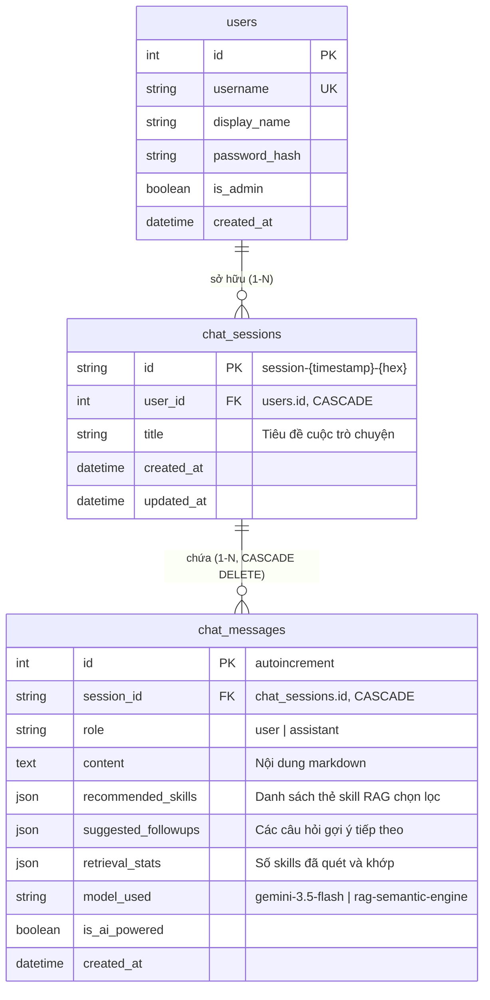
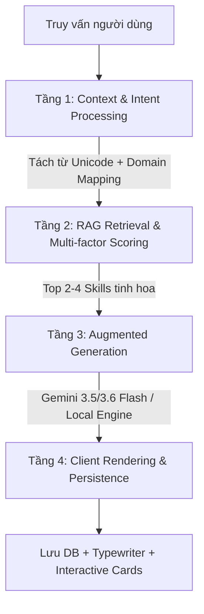

# Kiến Trúc Hệ Thống: RAG Agent Chat & Lưu Trữ Lịch Sử Database

Tài liệu thiết kế kỹ thuật chi tiết của tính năng **Agent Chat Cố Vấn Kỹ Năng (RAG)** trong hệ sinh thái **Agent Skill Trending**.

---

## 1. Tổng Quan & Mục Tiêu

Trong kho dữ liệu với hàng trăm AI Agent skills và MCP servers, người dùng thường gặp tình trạng **bội thực thông tin** khi chỉ dùng các bộ lọc tĩnh (category, runtime, tag) vì các bộ lọc này không giải thích được:
1. Kỹ năng nào thực sự giải quyết bài toán kiến trúc cụ thể (ví dụ: chống rò rỉ goroutine trong Go, tối ưu Server Actions trong Next.js 15, thiết kế WCAG dark mode).
2. Lý do cốt lõi nên chọn kỹ năng đó và mẹo thực chiến để tích hợp.
3. Cách phối hợp các kỹ năng với nhau trong môi trường thực tế.

**Agent Chat RAG** giải quyết triệt để vấn đề trên bằng cách kết hợp:
- **Retrieval (Truy xuất)**: Quét cơ sở dữ liệu kỹ năng cục bộ với thuật toán xếp hạng đa tầng (Domain Mapping, Metadata Tokenization, Popularity Boost).
- **Augmented Generation (Tổng hợp thông minh)**: Đưa các kỹ năng tinh hoa nhất làm Context cho Google Gemini (3.5/3.6 Flash) hoặc bộ tổng hợp nội bộ Local RAG Fallback để sinh câu trả lời trực diện, không dùng văn mẫu.
- **Database Persistence (Lưu trữ vĩnh viễn)**: Lưu trữ toàn bộ phiên chat và tin nhắn theo tài khoản người dùng (`user_id`) trên cơ sở dữ liệu PostgreSQL.
- **Authentication & Security (Bảo mật)**: Bắt buộc xác thực Bearer JWT Token để bảo vệ tài nguyên và cô lập lịch sử giữa các người dùng.

---

## 2. Sơ Đồ Tuần Tự (Sequence Diagram)

```mermaid
sequenceDiagram
    autonumber
    actor User as Người dùng (Kỹ sư)
    participant FE as Frontend (React + Typewriter)
    participant API as Backend API (/agent-chat)
    participant Auth as Auth Middleware (JWT)
    participant DB as PostgreSQL (Skills & Chat Tables)
    participant RAG as RAG Scoring Engine
    participant LLM as Google Gemini AI (3.5/3.6 Flash)

    User->>FE: Gửi câu hỏi kỹ thuật (VD: "Tối ưu Go microservice")
    FE->>API: POST /api/v1/agent-chat/message (Bearer Token, Query, SessionId)
    
    API->>Auth: Xác thực Bearer Token
    alt Token không hợp lệ hoặc thiếu
        Auth-->>FE: 401 Unauthorized
        FE-->>User: Hiển thị Login Gate (Yêu cầu đăng nhập)
    else Token hợp lệ
        Auth-->>API: Trả về User info (user_id)
    end

    rect rgb(30, 41, 59)
    Note over API,DB: Bước 1: Lưu User Message & Khởi tạo Session
    API->>DB: Tạo / Cập nhật chat_sessions (title, updated_at)
    API->>DB: INSERT INTO chat_messages (role='user', content=query)
    end

    rect rgb(20, 30, 45)
    Note over API,RAG: Bước 2: RAG Retrieval & Candidate Ranking
    API->>DB: SELECT * FROM skills
    DB-->>API: Danh sách 450+ skills & metadata
    API->>RAG: Domain intent mapping + Unicode token scoring + Quality boost
    RAG-->>API: Top 2-4 Skills phù hợp nhất kèm điểm relevance
    end

    rect rgb(15, 23, 42)
    Note over API,LLM: Bước 3: Augmented Generation
    API->>LLM: Gửi Prompt (Context Skills + User Query + Multi-turn history)
    alt Gemini Phản hồi thành công
        LLM-->>API: Markdown phân tích kỹ thuật + Follow-up questions
    else Gemini Quota / Offline
        API->>API: Fallback sang Local RAG Synthesis Engine
    end
    end

    rect rgb(30, 41, 59)
    Note over API,DB: Bước 4: Lưu Assistant Message vào Database
    API->>DB: INSERT INTO chat_messages (role='assistant', content, recommended_skills JSON, followups)
    API->>DB: COMMIT Transaction
    end

    API-->>FE: Response {session_id, message, recommended_skills, suggested_followups}
    
    rect rgb(24, 32, 47)
    Note over FE,User: Bước 5: Trình diễn Client-side
    FE->>User: Typewriter nhả chữ mượt mà qua requestAnimationFrame
    FE->>User: Render Interactive Skill Cards + Nút "Xem Chi Tiết" + Follow-up Chips
    end
```



---

## 3. Thiết Kế Cơ Sở Dữ Liệu (Database Schema & ERD)

Toàn bộ dữ liệu phiên trò chuyện và tin nhắn được liên kết quan hệ chặt chẽ với bảng `users`:



### Quy Tắc Toàn Vẹn Dữ Liệu:
- **`ON DELETE CASCADE`**: Khi người dùng xóa một `chat_sessions`, toàn bộ các bản ghi `chat_messages` thuộc phiên đó sẽ tự động bị xóa sạch khỏi cơ sở dữ liệu, không để lại dữ liệu rác.
- **Lọc phiên rỗng**: Danh sách phiên chỉ trả về các phiên có ít nhất `1 tin nhắn` (`len(messages) > 0`). Người dùng bấm tạo mới sẽ chỉ tạo bản nháp (draft) trên client, chỉ khi gửi tin nhắn đầu tiên mới chính thức ghi nhận vào DB.

---

## 4. Chi Tiết Thuật Toán RAG 4 Tầng



### Tầng 1: Tiền Xử Lý Ngữ Cảnh (Context & Intent Processing)
- Chuẩn hóa văn bản chữ thường, hỗ trợ tiếng Việt có dấu (`Đ`, `ă`, `ơ`...) qua regex Unicode `[\w\.\-]+`.
- Lọc bỏ stop-words vô nghĩa tiếng Việt và tiếng Anh.
- Ghép nối 2 lượt chat gần nhất để AI hiểu ngữ cảnh đa lượt (multi-turn context).

### Tầng 2: Thuật Toán Điểm Số Đa Tiêu Chí (Multi-Factor Scoring)
Điểm số của từng kỹ năng được tính toán dựa trên:
1. **Domain Triggers (Trọng số 45.0 - 10.0)**:
   - Các từ khóa đặc thù ngành (VD: `goroutine`, `race condition` -> kích hoạt nhóm Golang; `wcag`, `tailwind`, `dark mode` -> kích hoạt nhóm UI/UX; `subagent`, `skill.md` -> kích hoạt nhóm Antigravity).
2. **Metadata Matching (Trọng số 35.0 - 6.0)**:
   - Khớp ưu tiên: `name` (30) > `title` (25) > `language` (35) > `category` (25) > `tags` (20) > `ai_summary` (10) > `readme` (6).
   - **Ràng buộc Word Boundary (`\b`)** cho các từ ngắn (<= 3 ký tự như `ui`, `ux`, `go`, `ai`) để ngăn chặn việc match nhầm vào `JavaGuide` hay `algorithm`.
3. **Quality & Popularity Boost**:
   - `trending_score * 0.1` (tối đa +10 điểm).
   - `quality_score * 0.05` (tối đa +5 điểm).
   - `is_featured` (+5 điểm).

### Tầng 3: Tổng Hợp Nội Dung Trực Diện (Augmented Generation)
- **Primary Engine**: Google Gemini API (`gemini-3.5-flash` và `gemini-3.6-flash`). System prompt được cấu hình nghiêm ngặt cấm văn mẫu dập khuôn, đi thẳng vào phân tích kiến trúc, chỉ ra điểm mạnh của từng skill và cách kết hợp thực tế.
- **Zero-Downtime Fallback Engine**: Nếu gặp lỗi quota (429) hoặc mất mạng, hệ thống tự động kích hoạt `_synthesize_local_rag_response` với các mở đầu thông minh theo chuyên ngành (UI/UX, Backend, Security...), đảm bảo dịch vụ không bao giờ bị gián đoạn.

### Tầng 4: Trình Diễn Client & Typewriter An Toàn
- Render markdown bằng `parseMarkdownBlocks` có cơ chế thoát an toàn (chống vòng lặp vô tận khi AI đang gõ dở ký tự `#` hoặc code block).
- Sử dụng `requestAnimationFrame` và chu kỳ 22ms tạo cảm giác gõ chữ tự nhiên như ChatGPT.
- Hiển thị các thẻ kỹ năng tương tác với phân cấp Z-index cao hơn drawer (`z-[70]`), cho phép mở modal xem chi tiết và tài liệu đầy đủ.

---

## 5. Danh Sách API Endpoints

Tất cả các endpoint sau (trừ `/suggestions`) đều yêu cầu Header: `Authorization: Bearer <JWT_TOKEN>`.

| Phương thức | Đường dẫn | Chức năng | Phân quyền |
|---|---|---|---|
| `GET` | `/api/v1/agent-chat/suggestions` | Lấy danh sách prompt mẫu gợi ý | Công khai |
| `GET` | `/api/v1/agent-chat/sessions` | Lấy danh sách phiên trò chuyện của user | Bắt buộc Đăng nhập |
| `POST` | `/api/v1/agent-chat/sessions` | Tạo phiên trò chuyện mới | Bắt buộc Đăng nhập |
| `GET` | `/api/v1/agent-chat/sessions/{id}` | Lấy chi tiết phiên và lịch sử tin nhắn | Bắt buộc Đăng nhập |
| `PATCH` | `/api/v1/agent-chat/sessions/{id}` | Đổi tên tiêu đề phiên chat | Bắt buộc Đăng nhập |
| `DELETE` | `/api/v1/agent-chat/sessions/{id}` | Xóa phiên chat và toàn bộ tin nhắn liên quan | Bắt buộc Đăng nhập |
| `POST` | `/api/v1/agent-chat/message` | Gửi câu hỏi, thực thi RAG và lưu vào DB | Bắt buộc Đăng nhập |

### Payload Mẫu: `POST /api/v1/agent-chat/message`
```json
{
  "query": "Tôi đang gặp vấn đề rò rỉ goroutine trong Go microservices",
  "session_id": "session-1725849201-ab3f",
  "history": [
    { "role": "user", "content": "Tôi muốn học Go" },
    { "role": "assistant", "content": "Bạn nên bắt đầu với uber-go-guide." }
  ],
  "language": "vi"
}
```

### Response Mẫu:
```json
{
  "success": true,
  "session_id": "session-1725849201-ab3f",
  "message": "### 🎯 Phân tích chuyên sâu từ Cố vấn Kỹ năng AI\n\nĐối với bài toán rò rỉ goroutine leak...",
  "recommended_skills": [
    {
      "skill": {
        "id": 42,
        "name": "uber-go-guide",
        "title": "Uber Go Style Guide & Best Practices",
        "category": "coding-agent",
        "trending_score": 96.5
      },
      "relevance_score": 92.5,
      "match_reasons": [
        "Chống rò rỉ goroutine leak, race condition & chuẩn hóa table-driven test trong Go",
        "Áp dụng trực tiếp quy chuẩn Uber Go Style Guide & Clean Architecture"
      ],
      "quick_tip": "Thiết lập golangci-lint với rule govet/lostcancel trong file cấu hình agent."
    }
  ],
  "suggested_followups": [
    "Làm sao để tích hợp rule phòng chống goroutine leak vào CI/CD?",
    "Cho tôi xem ví dụ test race condition với table-driven tests."
  ],
  "retrieval_stats": {
    "total_skills_scanned": 452,
    "candidates_matched": 3,
    "top_selected": 3
  },
  "model_used": "gemini-3.5-flash",
  "is_ai_powered": true
}
```

---

*Tài liệu được cập nhật tự động và lưu trữ chính thức trong repository dự án tại `docs/AGENT_CHAT_RAG_ARCHITECTURE.md`.*
